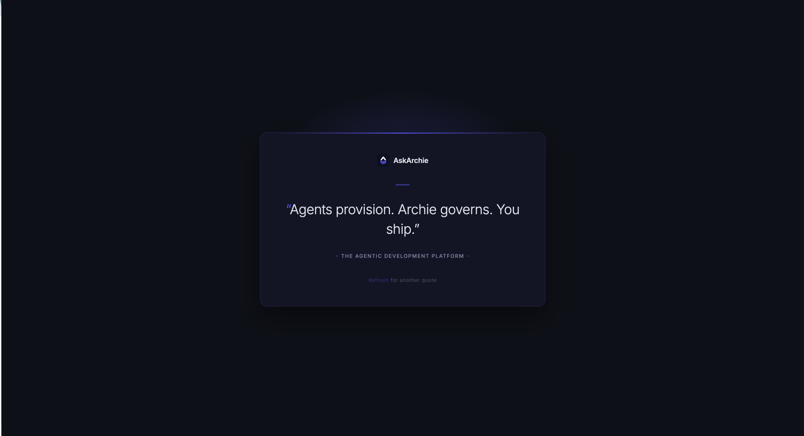

# Quotes page

The little page that shows a different AskArchie quote every time you reload it.

Rodrigo put this together for Marketing to look at before launch. It's the real
copy, the real fonts, the real layout — just small.



That's what it should look like. If yours doesn't, something is wrong with the
setup rather than with the page — the layout is all in `handler.py`.

## Running it on your machine

```bash
python3 container/server.py
```

Then open <http://localhost:8080> and refresh a few times.

That's genuinely all of it. Nothing to install first — no `pip install`, no
database, no config file. If Python opens, this runs.

## What's in here

| | |
|---|---|
| `handler.py` | the page itself: the quotes, and the HTML around them |
| `container/` | the bits that let it run somewhere other than a laptop |

If you just want to change the wording of a quote, it's the list at the top of
`handler.py`. Nothing else needs touching.

## Getting it somewhere the team can see it

Not covered here — this only runs while your terminal is open, on your machine.
Somebody with cloud access needs to put it somewhere with a real link.

Worth mentioning to them: it's a plain Python request handler, so it doesn't
need a server sitting there waiting. There's a `container/` folder too, if
that's easier for them.
